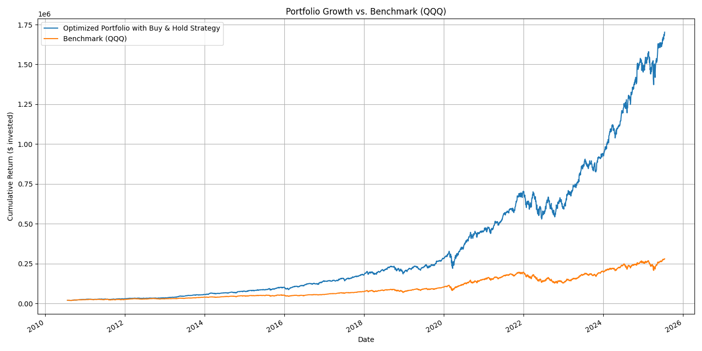
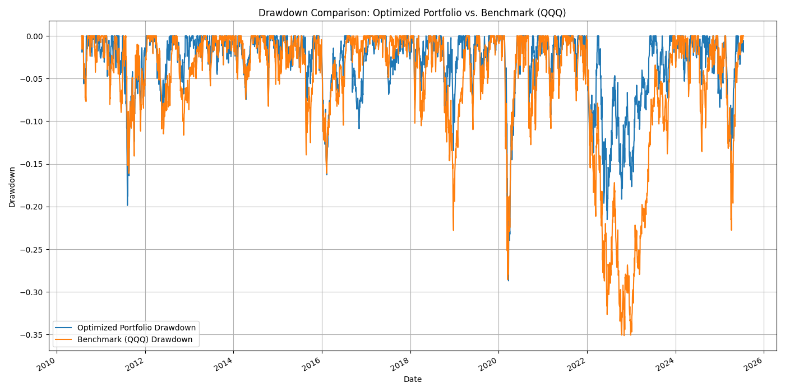

Hybrid Quantum-Portfolio-Optimization


In this project, I explored the intersection of Quantitative Finance and Quantum-inspired Computing. 
My goal was to develop and rigorously test a systematic investment strategy to build an optimal portfolio from the NASDAQ-100 stock universe, aiming to outperform the market benchmark.

This repository documents the entire process, from data acquisition to a final performance backtest.

1. *The Problem: The Dual Challenge of Portfolio Optimization*

Building an effective investment portfolio presented me with a twofold challenge:

1)*Asset Selection*: From a universe of nearly 100 stocks, which specific subset should I choose? This is a massive combinatorial optimization problem. Selecting just 10 stocks from this universe yields over 17 trillion possible combinations, making a brute-force search computationally impossible.

2)*Asset Allocation*: Once I've selected the assets, what percentage of my capital should I allocate to each to achieve the best possible risk-adjusted return?

My objective was to create a portfolio that could consistently outperform a passive investment in a broad market index like the NASDAQ-100 (represented by the ETF: QQQ).

2. *My Hybrid Solution*

To tackle this complex problem, I designed a two-phase hybrid strategy, believing in using the right computational tool for the right task.

Phase 1: Quantum-inspired Asset Selection. For the vast combinatorial selection problem, I leveraged a method inspired by Quantum Annealing to efficiently explore the solution space and identify a promising subset of assets.

Phase 2: Classical Precision Allocation. With a smaller, manageable set of assets, I then used a powerful classical optimizer to find the mathematically optimal capital allocation.

3. Methodology
3.1. Phase 1: Asset Selection via QUBO

To solve the asset selection problem, my first step was to model it as a QUBO (Quadratic Unconstrained Binary Optimization), a format that quantum annealers and their simulators are designed to solve.

The Financial Model: Markowitz Mean-Variance Optimization

My selection strategy is based on the Nobel Prize-winning Modern Portfolio Theory by Harry Markowitz. The goal is to find a portfolio that minimizes risk for a given level of return. I formulated this as a cost function to be minimized:

Cost = (Risk Aversion * Portfolio Risk) - Portfolio Return

This approach allows me to find a portfolio on the "Efficient Frontier", balancing risk and reward.
I chose a risk aversion coefficient of **`gamma = 0.5`**. This value represents a **balanced approach**, giving equal importance to both minimizing risk and maximizing return. It is neither overly aggressive nor overly conservative, making it an excellent starting point for building a robust portfolio. The value of this parameter could be tuned to create portfolios tailored to different investor risk profiles.

The Mathematical Translation: QUBO Formulation

I translated this financial objective into the QUBO mathematical framework. The general QUBO formula is:


Where x_i is a binary variable that is 1 if I select stock i, and 0 otherwise. I constructed the Q matrix to represent my financial model:

Q_ii (diagonal terms): These encode the individual characteristics of each stock. Here, I mapped the expected return (-μ_i) and the individual risk, or variance (γ * σ_ii).
Q_ij (off-diagonal terms): These are the most critical terms for risk management. They encode the interactions between pairs of stocks. Here, I mapped the covariance (γ * Σ_ij), which measures how two stocks move together. By including this term, the QUBO model is explicitly incentivized to find a set of stocks that are not highly correlated with each other. This is the mathematical foundation of diversification; the model doesn't just minimize individual volatility, it actively seeks a combination of assets that work well together to lower the overall portfolio risk.

My constraint to select exactly K stocks was added as a quadratic penalty term P * (Σ x_i - K)², which adds a very high cost to any solution that does not respect this rule.

For this project, I used D-Wave's SimulatedAnnealingSampler to solve the QUBO problem, allowing me to efficiently find a high-quality subset of K=10 stocks from the full NASDAQ-100 universe.

3.2. Phase 2: Optimal Allocation via Sharpe Ratio Maximization

With my 10 selected assets, I moved to the allocation phase. My objective here was to find the optimal weights w for these stocks.

The Financial Model: Maximizing the Sharpe Ratio

The Sharpe Ratio is the gold standard for measuring risk-adjusted return. It elegantly answers the question: "How much excess return am I getting for each unit of risk I take on?".


Where R_p is the portfolio's expected return, R_f is the risk-free rate, and σ_p is the portfolio's volatility.

The Mathematical Optimization

Standard optimizers are typically designed to minimize a function. I therefore framed my problem as minimizing the negative of the Sharpe Ratio, in this i basically maximize my Sharpe Ratio I used the powerful SLSQP algorithm from the scipy.optimize library to solve the following:


Subject to the constraints: Σ w_i = 1 (all capital is invested) and 0 ≤ w_i ≤ 1 (no short selling).
----------------------------------------------------------------------------------------------------------------------------------------------------------
It is important to note that even though the QUBO phase provides a shortlist of 10 promising assets, the final allocation optimizer may assign a weight of **0%** to some of them. This is not an error, but an expected and intelligent outcome of the optimization process. It occurs when the algorithm determines that, to mathematically maximize the Sharpe Ratio for the *entire portfolio*, the inclusion of a specific asset—even a "good" one—would either introduce redundant risk or not provide enough return to justify its inclusion, thus making the portfolio more efficient by excluding it.
----------------------------------------------------------------------------------------------------------------------------------------------------------
4. Results and Performance

I backtested the final strategy on 15 years of historical data. The results clearly demonstrate a significant outperformance against the NASDAQ-100 benchmark (QQQ).


Metric	Optimized Portfolio	Benchmark (QQQ)
Sharpe       1.41    0.81
CAGR 	     34.60%	 19.31%
Total Return 5000+%  1300%  
Max Drawdown -32.84	-35.12%


My strategy not only delivered superior returns but also proved to be more resilient, exhibiting a smaller maximum drawdown during market downturns. This highlights the effectiveness of the intelligent diversification achieved through the QUBO model and the precision of the final allocation.
Furthermore, the strategy is close to double the QQQ Sharpe Ratio, which is an incredible result.
5.## 7. Conclusion and Future Work

### Conclusion
This project successfully demonstrates the power of a hybrid computational strategy in quantitative finance. By combining a quantum-inspired approach for the complex task of asset selection with a classical optimizer for precision allocation, I was able to construct a portfolio that significantly outperformed the NASDAQ-100 benchmark on a historical basis. The results highlight the importance of not only selecting assets with high potential but also of structuring the portfolio to maximize diversification and risk-adjusted returns.

### Future Work
While this model provides a solid and effective foundation, there are several exciting avenues for future development to enhance its robustness and performance:

*   **Dynamic Backtesting:** Implement a rolling-window backtest with periodic rebalancing (e.g., quarterly). This would simulate a more realistic strategy that adapts to changing market conditions over time, rather than relying on a static "buy-and-hold" approach.
*   **Hyperparameter Optimization:** Use an automated optimization library like **Optuna** to systematically find the best possible combination of key parameters (`K` and `gamma`), potentially unlocking even better performance.
*   **Inclusion of Alternative Data:** Enrich the model with non-price data, such as sentiment analysis from financial news or alternative datasets, to gain a more holistic view of the market and potentially capture alpha from different sources.
*   **Advanced Risk Models:** Move beyond historical covariance to more sophisticated risk models, such as those that can account for "tail risk" or changing correlation regimes.

This project serves as a strong proof-of-concept, and these future steps would bring it even closer to a professional-grade, systematic investment strategy.
6. How to Use This Repository

Clone the repository:

Generated bash
git clone https://github.com/your-username/your-repo-name.git
cd your-repo-name


Create a virtual environment and install dependencies:

Generated bash
python -m venv venv
source venv/bin/activate  # On Windows, use `venv\Scripts\activate`
pip install -r requirements.txt
```3.  **Run the analysis:**
Open and run the `01_Quantum_Portfolio_Optimization.ipynb` notebook in the `notebooks/` directory using Jupyter Lab or a similar environment.
IGNORE_WHEN_COPYING_START
content_copy
download
Use code with caution.
Bash
IGNORE_WHEN_COPYING_END
7. Technology Stack

Language: Python 3.12.9

Core Libraries: Pandas, NumPy, Scipy

Data Source: yfinance

Quantum-inspired Computing: D-Wave Ocean SDK (dwave-ocean-sdk)

Visualization: Matplotlib, Seaborn
----------------------------------------------------------------------------------------------------------------------------------------------------------
## Limitations

This project is intended as a demonstration of how quantum-inspired optimization techniques (QUBO) can be applied to financial portfolio selection. It is not designed to outperform the market or to be used as a real-world investment strategy. The main limitations are:

- The quantum annealing step is simulated on classical hardware, not on a real quantum computer.
- Parameter choices (such as the number of assets, risk aversion, and penalty terms) are set manually and not optimized.
- The backtest is a simple buy & hold simulation, without periodic rebalancing or out-of-sample validation.
- The list of NASDAQ-100 tickers is static and does not account for index changes over time (survivorship bias).
- No transaction costs, taxes, or liquidity constraints are considered.
- The results are for academic and illustrative purposes only, to show the potential of quantum-inspired methods in finance.

**This project is for educational and research purposes only. It is not financial advice and should not be used for real investment decisions.**